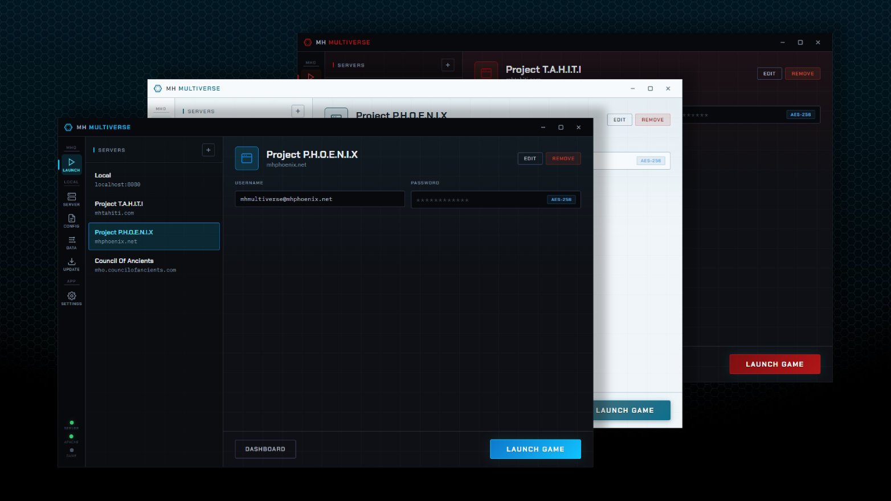
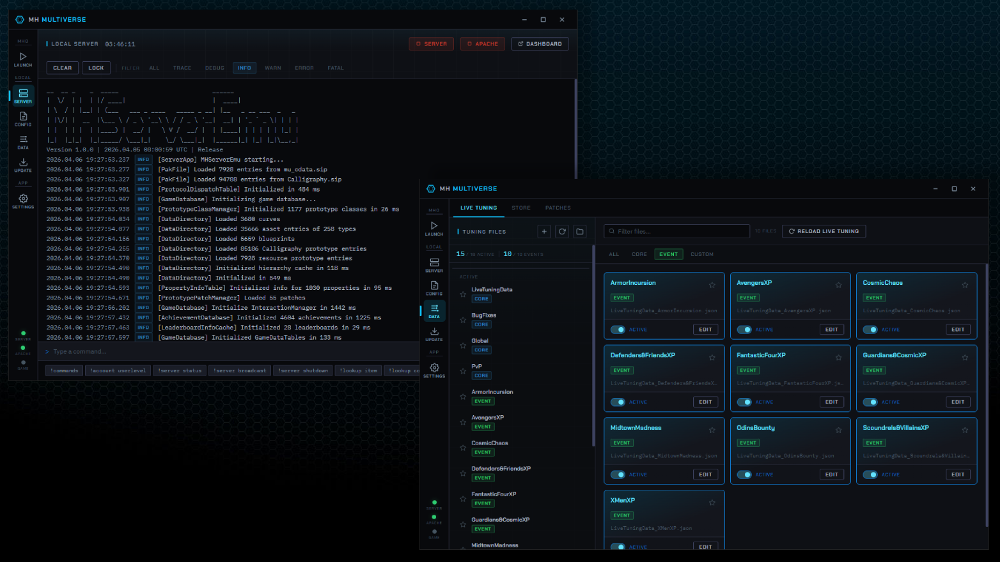

# MH Multiverse

A desktop launcher and server management tool for [MHServerEmu](https://github.com/Crypto137/MHServerEmu), the Marvel Heroes Omega server emulator. Built with Tauri 2, Svelte 5, and Rust.

---

## Overview

MH Multiverse provides a single interface for launching Marvel Heroes Omega, managing a local MHServerEmu instance, and editing the server's data files. It handles process lifecycle, credential storage, config editing, live tuning, data patching, MTX store catalog editing, server updates, and backups.

The app is currently Windows-only and communicates with the server via stdin/stdout piping and direct file I/O against MHServerEmu's data directories.

---

## Features

### Game Launching
- Multi-server profile management with per-server credentials. Local server profiles support both patched and unpatched client configurations
- Encrypted password storage via OS keychain (Windows Credential Manager)
- Auto-login support - email and password passed as command-line arguments
- Configurable launch flags: skip startup movies, skip motion comics, no sound, client logging, custom resolution, robocopy, no-Steam mode

### Local Server Management
- Start and stop MHServerEmu with stdout/stderr log streaming to an in-app console
- Interactive command input with autocomplete drawn from the MHServerEmu command list
- View logged in players and easily access moderation commands like setting user account level, kick, ban and whitelist
- Timed shutdown with configurable delay and broadcast message
- Independent Apache start/stop for players running in offline mode without the reverse proxy
- Windows Job Object integration - child processes are killed automatically if MH Multiverse crashes or is force-closed

### Server Configuration (INI Editor)
- Visual editor for MHServerEmu's `Config.ini` / `ConfigOverride.ini` with grouped sections, tooltips, and type-appropriate controls (toggles, dropdowns, numeric inputs)
- Diff-only saving - only values that differ from `Config.ini` defaults are written to `ConfigOverride.ini`
- Per-section reset to defaults
- Currently displays a subset of the full `Config.ini` options for simplicity, though more may be added in future

### Events & Live Tuning Editor
- Scan, create, edit, and toggle Events and `LiveTuningData*.json` files in `Data/Game/LiveTuning`
- Attach new or existing live tuning files to event schedules to customise event rotations
- Create custom live tuning files with the help of settings autocomplete and prototype path searching
- Tag-based organisation (Core, Event, Custom) with favourites pinning
- Category-aware setting enum validation (Global, World Entity, Power, Region, Loot, etc.)

### Data Patching Editor
- Scan, create, edit, and toggle `PatchData*.json` files in `Data/Game/Patches`
- Enable/disable patch files by moving between `Patches/` and `Patches/Off/`
- Per-entry enable/disable, prototype path, field path, value type, and value editing
- Prototype picker and value type dropdown matching MHServerEmu's supported patch value types

### Store Catalog Editor
- Load, create, edit, and delete catalog entries across `Catalog*.json` files in `Data/Game/MTXStore`
- Non-destructive editing - saves always write to `*MODIFIED.json` sidecar files; base catalog files are never modified
- Automatic `.bak` snapshots before every write
- Prototype item picker with display name resolution (embedded + custom override maps)
- Type and modifier assignment matching MHServerEmu's catalog type system
- Bundle HTML page generation for in-game store display, with customisable CSS

### Server Updates & Backups
- One-click update from MHServerEmu nightly builds (download, extract, install)
- Configurable backup targets (INI files, LiveTuning directory, account database, full Data directory)
- Automatic pre-update backup with post-update restore of user-modified files
- Manual backup creation, restore, and deletion with manifest tracking

### Application Settings
- Game and server executable path configuration with file browser
- Five colour themes

### Calligraphy.sip Integration
- Binary pak reader for `Calligraphy.sip` - parses blueprint and prototype directory records
- Prototype search by path and display name, filtered by category/blueprint
- Runtime prototype ID and GUID resolution for tuning, patching, and store editors
- Cached per server executable path, automatically rebuilds when the server changes




---

## Installation

### Prerequisites
- [Node.js](https://nodejs.org/) (LTS)
- [Rust](https://rustup.rs/) (stable, 1.77.2+)
- [Tauri CLI](https://v2.tauri.app/start/prerequisites/) prerequisites for your platform

### Setup
```cmd
npm install
```

### Development
```cmd
npm run tauri dev
```

### Production Build
```cmd
npm run tauri build
```

### Type Checking
```cmd
npm run check
```

### Config File Location
```
%APPDATA%\com.mhmultiverse.app\multiverse.json
```

### NOTE
*MH Multiverse is an unsigned executable that starts other processes (e.g Marvel Heroes Omega, MHServerEmu) and creates, writes and reads files (e.g ConfigOverride.ini, Data Patching, Live Tuning). Like Bifrost, this may cause false positive detections from antivirus software. If this causes issues, with the prerequisites installed the source code can be built with just two commands.* 

---

## Planned Updates

With the first implementation of the Event/LiveTuning system overhaul following the recent MHServerEmu update in place, I'm back to UI/UX polishing and bug fixes. I'm also looking to make the calligraphy.sip parsing smoother (and in particular less reliant on `display_names.json` for prototype ID -> display name replacement). If there's enough interest, I'll also look into Linux support.

---

## Acknowledgements

A special thanks to all contributors of the [MHServerEmu](https://github.com/Crypto137/MHServerEmu) project for their tireless work in bringing Marvel Heroes Omega back to life.

Additionally, this project was inspired by the great work done in the following projects
- Crypto137: [Bifrost](https://github.com/Crypto137/Bifrost)
- Crypto137: [MHServerEmu.Gui](https://github.com/Crypto137/MHServerEmu.Gui)
- Crypto137: [OpenCalligraphy](https://github.com/Crypto137/OpenCalligraphy)
- mtzimas92: [MHServerEmu-CatalogManager](https://github.com/mtzimas92/MHServerEmu-CatalogManager)
- Pyrox37: [MHServerEmuUI](https://github.com/Pyrox37/MHServerEmuUI)
