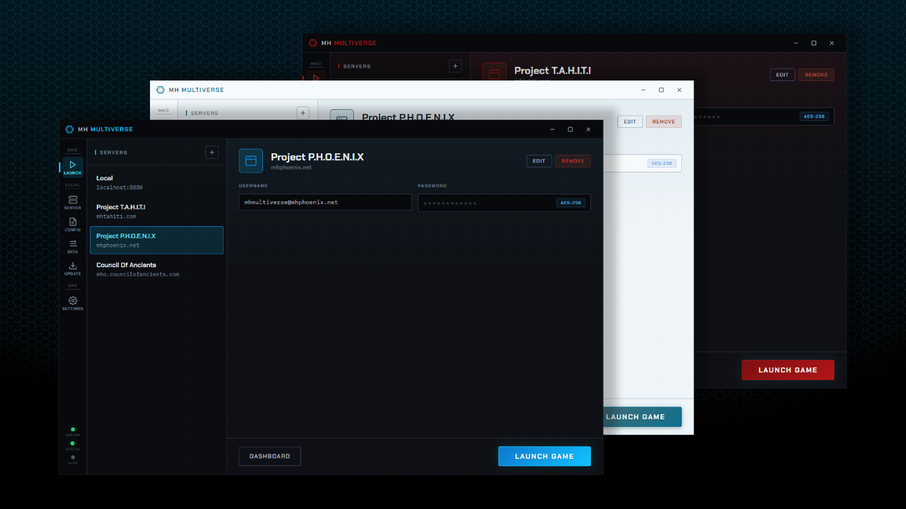
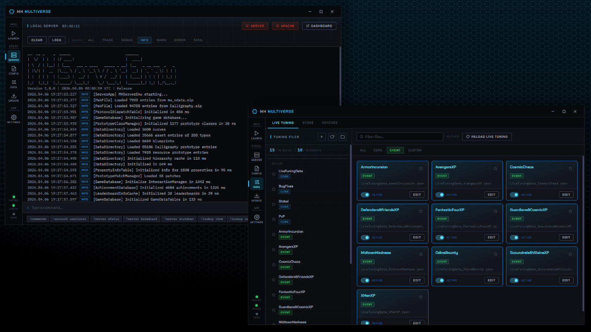

# MH Multiverse

A desktop launcher and server management tool for [MHServerEmu](https://github.com/Crypto137/MHServerEmu), the Marvel Heroes Omega server emulator. Built with Tauri 2, Svelte 5, and Rust.

---

## Overview

MH Multiverse provides a single interface for launching Marvel Heroes Omega, managing a local MHServerEmu instance, and editing the server's data files. It handles process lifecycle, profile management, config editing, live tuning, data patching, MTX store catalog editing, server updates, and backups.

The app is currently Windows-only and communicates with the server via stdin/stdout piping and direct file I/O against MHServerEmu's data directories.

---

## Features

### Game Launching
- Multi-server profile management with encrypted, OS-keychain-backed credentials and auto-login. Local profiles support both patched and unpatched clients
- Configurable launch flags (startup movies, motion comics, sound, resolution, robocopy, no-Steam, and more)
- Simplified flow for taking an `!account download` JSON backup and adding to a local MHServerEmu Account database

### Local Server Management
- Start/stop MHServerEmu with live log streaming and an interactive, autocomplete-backed command console
- View logged-in players with moderation shortcuts (user level, kick, ban, whitelist)
- Independent Apache start/stop for offline play

### Server Configuration (INI Editor)
- Visual editor for `Config.ini` / `ConfigOverride.ini` with grouped sections, tooltips, and type-appropriate controls
- Diff-only saving (only non-default values are written) with per-section reset

### Events & Live Tuning Editor
- Scan, create, edit, and toggle Events and `LiveTuningData*.json` files, with settings autocomplete and prototype path search
- Attach tuning files to event schedules to customise event rotations
- Tag-based organisation (Core, Event, Custom) with favourites

### Store Catalog Editor
- Load, create, edit, and delete `Catalog*.json` entries, with type/modifier assignment matching MHServerEmu's catalog system
- Non-destructive editing to `*MODIFIED.json` sidecars, with automatic `.bak` snapshots before every write
- Prototype item picker with display name resolution, and bundle HTML generation for the in-game store

### Data Patching Editor
- Scan, create, edit, and toggle `PatchData*.json` files, enabled/disabled via moves to `Patches/` / `Patches/Off/`
- Per-entry field path, value type, and value editing, with matching prototype and value-type pickers

### Server Updates & Backups
- One-click updates from MHServerEmu nightly builds, with automatic backup before and restore of modified files after
- Configurable backup targets, plus manual backup creation, restore, and deletion with manifest tracking

### Application Settings
- Game/server executable path configuration with file browser, and multiple app themes

### Calligraphy.sip Integration
- Reads the game's data file (`Calligraphy.sip`) to know the game's definitions for items, powers, regions, and other objects
- Search for any of these by name, with filters to narrow results down by type
- Powers the search boxes in the Live Tuning, Data Patching, and Store Catalog editors, so you can find things by name instead of a numeric ID
- Remembers what it's read so searches are fast, and updates automatically if you switch to a different server install




---

## Installation

### Prerequisites
- [Node.js](https://nodejs.org/) (LTS)
- [Rust](https://rustup.rs/) (stable, 1.77.2+)
- [Tauri CLI](https://v2.tauri.app/start/prerequisites/) prerequisites for your platform

### Setup
```cmd
npm install
```

### Development
```cmd
npm run tauri dev
```

### Build
```cmd
npm run tauri build
```

### Config File Location
```
%APPDATA%\com.mhmultiverse.app\multiverse.json
```

### NOTE
*MH Multiverse is an unsigned executable that starts other processes (e.g Marvel Heroes Omega, MHServerEmu) and creates, writes and reads files (e.g ConfigOverride.ini, Data Patching, Live Tuning). Like Bifrost, this may cause false positive detections from antivirus software. If this causes issues, with the prerequisites installed the source code can be built with just two commands.* 

---

## Planned Updates

The last update introduced Account Importing, which I'm already finding useful for testing builds locally. Next up, I'm looking to make the calligraphy.sip parsing smoother (and in particular less reliant on `display_names.json` for prototype ID -> display name replacement). If there's enough interest, I'll also look into Linux support, though it's not something I have any experience with.

---

## Acknowledgements

A special thanks to all contributors of the [MHServerEmu](https://github.com/Crypto137/MHServerEmu) project for their tireless work in bringing Marvel Heroes Omega back to life.

Additionally, this project was inspired by the great work done in the following projects
- Crypto137: [Bifrost](https://github.com/Crypto137/Bifrost)
- Crypto137: [MHServerEmu.Gui](https://github.com/Crypto137/MHServerEmu.Gui)
- Crypto137: [OpenCalligraphy](https://github.com/Crypto137/OpenCalligraphy)
- mtzimas92: [MHServerEmu-CatalogManager](https://github.com/mtzimas92/MHServerEmu-CatalogManager)
- Pyrox37: [MHServerEmuUI](https://github.com/Pyrox37/MHServerEmuUI)
